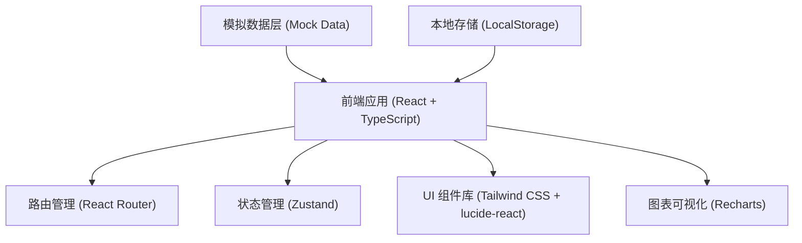
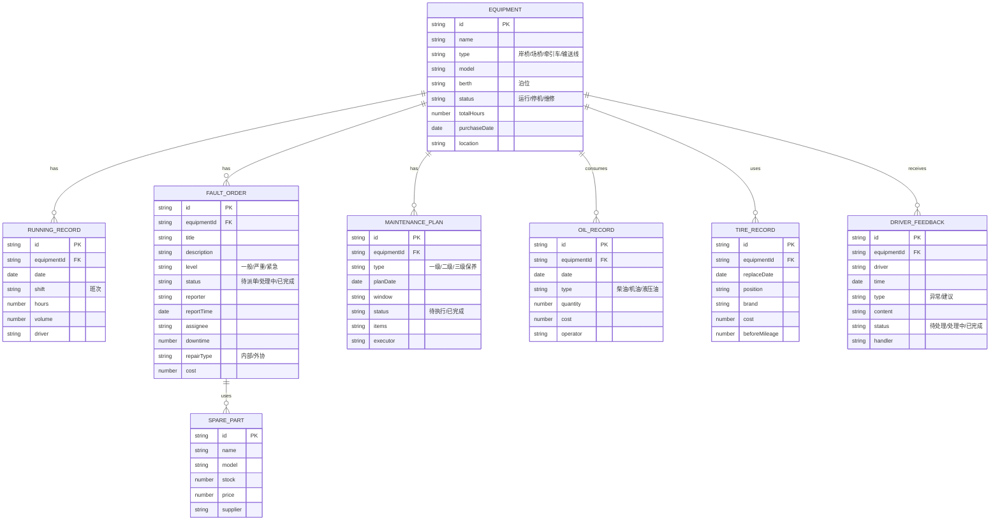

## 1. 架构设计



## 2. 技术描述

- **前端框架**: React@18 + TypeScript
- **构建工具**: Vite
- **样式方案**: Tailwind CSS@3
- **路由管理**: react-router-dom@6
- **状态管理**: zustand
- **图标库**: lucide-react
- **图表库**: recharts
- **后端**: 无后端，使用 Mock 数据和 LocalStorage 进行数据持久化
- **数据持久化**: LocalStorage

## 3. 路由定义

| 路由 | 页面 | 说明 |
|-------|---------|------|
| /dashboard | 作业看板 | 实时设备状态监控、泊位设备分布 |
| /equipment | 设备台账 | 设备列表、设备详情、设备调拨 |
| /running-hours | 运行小时 | 运行时长统计、班次记录 |
| /maintenance | 故障维修 | 故障工单、维修派单、停机登记 |
| /保养 | 保养排程 | 保养计划、保养窗口、安全检查 |
| /oil-tire | 油料轮胎 | 油料管理、轮胎更换、备件申请 |
| /driver-feedback | 司机反馈 | 异常提交、反馈处理 |
| /performance | 绩效统计 | 完好率统计、成本对比、绩效报表 |

## 4. 数据模型

### 4.1 数据模型定义



### 4.2 核心类型定义

```typescript
// 设备类型
type EquipmentType = 'quay-crane' | 'yard-crane' | 'tractor' | 'conveyor';
type EquipmentStatus = 'running' | 'stopped' | 'maintenance';

interface Equipment {
  id: string;
  name: string;
  type: EquipmentType;
  model: string;
  berth: string;
  status: EquipmentStatus;
  totalHours: number;
  purchaseDate: string;
  location: string;
  specs: Record<string, string>;
}

// 故障工单
type FaultLevel = 'normal' | 'serious' | 'urgent';
type FaultStatus = 'pending' | 'processing' | 'completed';

interface FaultOrder {
  id: string;
  equipmentId: string;
  title: string;
  description: string;
  level: FaultLevel;
  status: FaultStatus;
  reporter: string;
  reportTime: string;
  assignee?: string;
  downtime?: number;
  repairType: 'internal' | 'external';
  cost?: number;
  accidentRelated?: string;
}

// 运行记录
interface RunningRecord {
  id: string;
  equipmentId: string;
  date: string;
  shift: 'day' | 'night';
  hours: number;
  volume: number;
  driver: string;
}
```

## 5. 项目结构

```
e:\trae-bz\TraeProjects\1126/
├── src/
│   ├── components/          # 公共组件
│   │   ├── Layout/         # 布局组件
│   │   ├── Sidebar/        # 侧边栏
│   │   ├── Header/         # 顶部导航
│   │   ├── DataTable/      # 数据表格
│   │   ├── StatusBadge/    # 状态标签
│   │   └── StatCard/       # 统计卡片
│   ├── pages/              # 页面组件
│   │   ├── Dashboard/      # 作业看板
│   │   ├── Equipment/      # 设备台账
│   │   ├── RunningHours/   # 运行小时
│   │   ├── Maintenance/    # 故障维修
│   │   ├──保养/            # 保养排程
│   │   ├── OilTire/        # 油料轮胎
│   │   ├── DriverFeedback/ # 司机反馈
│   │   └── Performance/    # 绩效统计
│   ├── store/              # 状态管理
│   │   ├── equipmentStore.ts
│   │   ├── faultStore.ts
│   │   └── maintenanceStore.ts
│   ├── types/              # 类型定义
│   │   └── index.ts
│   ├── data/               # Mock 数据
│   │   └── mockData.ts
│   ├── utils/              # 工具函数
│   │   └── helpers.ts
│   ├── App.tsx
│   ├── main.tsx
│   └── index.css
├── .trae/documents/        # 项目文档
├── package.json
├── tsconfig.json
├── vite.config.ts
└── tailwind.config.js
```

## 6. 组件设计原则

1. **单一职责**: 每个组件只负责一个功能，保持代码简洁可维护
2. **可复用性**: 提取公共组件（表格、卡片、表单控件等）供多页面使用
3. **类型安全**: 所有组件使用 TypeScript 类型定义
4. **性能优化**: 合理使用 useMemo、useCallback 避免不必要的重渲染
5. **状态隔离**: 页面级状态使用 zustand 管理，组件内部状态使用 useState
